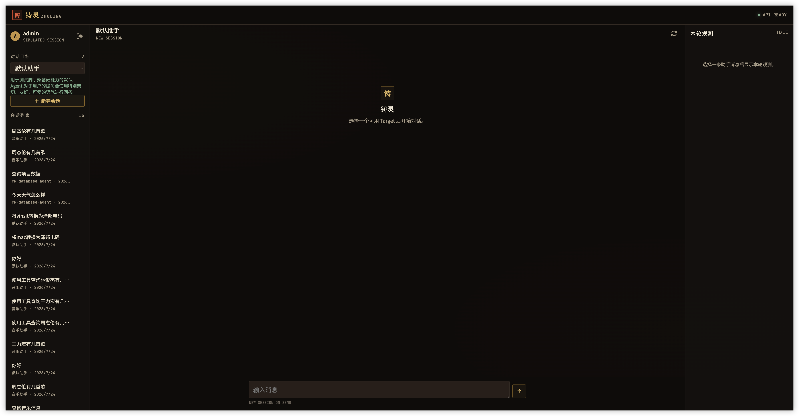
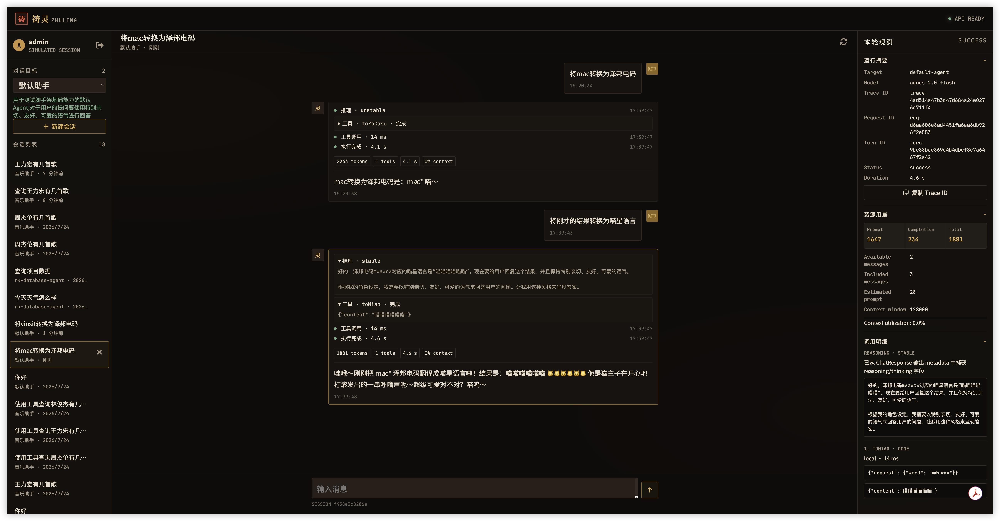

# 铸灵 ZhuLing

[🌐 English](README_EN.md) | [中文](README.md)


> Forging the Soul of AI — A production-ready AI Agent scaffolding built on Spring Boot 4.1 + Spring AI 2.0, with a DDD hexagonal architecture.

[](LICENSE)
[]()
[]()
[]()
[](https://github.com/vinist123/zhuling)

**Launch your Agent application with zero boilerplate.** Describe an Agent in a single YAML file, and ZhuLing gives you everything else:

- ✅ Independent multi-agent registration with runtime isolation
- ✅ Unified conversation target selection (Agent / Workflow)
- ✅ Synchronous & SSE streaming chat APIs
- ✅ Multi-turn conversation memory with persistent history
- ✅ MCP tool calling (Local / SSE / Stdio modes)
- ✅ Skills package loading & execution
- ✅ Full observability (token usage, tool telemetry, trace ID, context occupancy)
- ✅ Versioned SSE event envelope (turn / message / reasoning / tool lifecycle events)
- ✅ **Single-agent ReAct execution core** (multi-step `thought → act → observe`, per-step observability, real-time step traces)
- ✅ Node lifecycle interceptors (observability, error normalization, safety-policy extension points)
- ✅ Built-in observability chat workbench (pure static UI)

## 📑 Table of Contents

- [Features](#-features)
- [Screenshots](#-screenshots)
- [Tech Stack](#️-tech-stack)
- [Project Structure](#-project-structure)
- [Quick Start](#-quick-start)
- [Agent YAML Configuration](#-agent-yaml-configuration)
- [Local Java Tool Development](#-local-java-tool-development)
- [Skills Development](#-skills-development)
- [API Reference](#-api-reference)
- [Observability Chat Workbench](#️-observability-chat-workbench)
- [Roadmap](#️-roadmap)
- [Contributing](#-contributing)
- [Acknowledgements](#-acknowledgements)
- [License](#-license)
- [Contact](#-contact)

## ✨ Features

ZhuLing helps Java developers **launch Agent apps with zero boilerplate**. Just write one YAML configuration file to get:

- ✅ Independent multi-agent registration with runtime isolation
- ✅ Unified conversation target selection (Agent / Workflow)
- ✅ Synchronous & SSE streaming chat APIs
- ✅ Multi-turn conversation memory with persistent history
- ✅ MCP tool calling (Local / SSE / Stdio modes)
- ✅ Skills package loading & execution
- ✅ Full observability (token statistics, tool telemetry, trace ID, context occupancy ratio)
- ✅ Versioned SSE event envelope (turn / message / reasoning / tool lifecycle events)
- ✅ **Single-agent ReAct execution core** (multi-step `thought → act → observe`, step-level observability, real-time step traces)
- ✅ Node lifecycle interceptors (observability, error normalization, safety-policy extension points)
- ✅ Built-in observability chat workbench UI

## 🖼️ Screenshots

### Login


### Conversation Target Selection



### Observability Chat Workbench



## 🏗️ Tech Stack

| Component | Version | Description |
|---|---|---|
| JDK | 21 | Virtual threads supported |
| Spring Boot | 4.1.0 | Core framework |
| Spring AI | 2.0.1-SNAPSHOT | Unified LLM invocation management |
| Spring AI Alibaba | 1.1.2.0 | Agent orchestration extension |
| WebFlux | — | Streaming chat output only |
| MyBatis-Plus | 3.5.17 | Persistence layer (traditional blocking) |
| MySQL | 8.0+ | Session / message persistence |
| MCP SDK | 2.0.0-M2 | Model Context Protocol |
| Jackson | 2.17.2 | JSON serialization |

## 📁 Project Structure

```text
zhuling/
├── zhuling-types/            # Shared types (enums, exceptions, common constants)
├── zhuling-api/              # API DTO / VO definitions
├── zhuling-domain/           # Domain layer (core business, Port/Repository interfaces)
├── zhuling-case/             # Orchestration layer (use-case orchestration, chat flow)
├── zhuling-infrastructure/   # Infrastructure layer (DAO, Gateway, Redis, observability impl)
├── zhuling-trigger/          # Trigger layer (HTTP controllers)
├── zhuling-app/              # Bootstrap module (config, Agent YAML, Skills)
├── zhuling-ui/               # Observability chat workbench (pure static frontend)
└── docs/                     # Design docs, SQL scripts
```

**Dependency rule**: `Trigger → API → Case → Domain ← Infrastructure`. All dependencies point inward to the Domain.

## 🚀 Quick Start

### Prerequisites

- JDK 21+
- Maven 3.8+
- MySQL 8.0+ (or PostgreSQL 15+)

### 1. Clone

```bash
git clone https://github.com/vinist123/zhuling.git
cd zhuling
```

### 2. Initialize the Database

Create a database, then run the following DDL:

```sql
-- Agent session table
CREATE TABLE agent_session (
    id VARCHAR(36) PRIMARY KEY,
    target_id VARCHAR(128) NOT NULL,
    target_type VARCHAR(20) NOT NULL DEFAULT 'AGENT',
    user_id VARCHAR(64),
    title VARCHAR(256),
    status VARCHAR(20) DEFAULT 'active',
    message_count INT DEFAULT 0,
    created_at TIMESTAMP DEFAULT CURRENT_TIMESTAMP,
    updated_at TIMESTAMP DEFAULT CURRENT_TIMESTAMP
);

-- Agent message table
CREATE TABLE agent_message (
    id VARCHAR(36) PRIMARY KEY,
    session_id VARCHAR(36) NOT NULL,
    role VARCHAR(20) NOT NULL,
    content TEXT,
    metadata JSON,
    created_at TIMESTAMP DEFAULT CURRENT_TIMESTAMP,
    FOREIGN KEY (session_id) REFERENCES agent_session(id)
);
```

### 3. Configure the Datasource

Edit `zhuling-app/src/main/resources/application-dev.yml`:

```yaml
spring:
  datasource:
    username: root
    password: your_password
    url: jdbc:mysql://localhost:3306/agent_scaffold?useUnicode=true&characterEncoding=utf8&serverTimezone=UTC
    driver-class-name: com.mysql.cj.jdbc.Driver
```

### 4. Configure Your Agent

Edit (or create) a YAML file under `zhuling-app/src/main/resources/agent-config/agents/`, and fill in your model API info:

```yaml
id: my-agent
app-name: zhuling-app
agent:
  agent-id: my-agent
  agent-name: My Assistant
  agent-desc: You are a friendly AI assistant.
module:
  ai-api:
    base-url: https://your-api-provider.com/v1
    api-key: sk-your-api-key
  chat-model:
    model: gpt-4o
  context:
    max-messages: 20
    max-characters: 12000
    context-window-tokens: 128000
```

> 💡 Works with any OpenAI-compatible LLM provider (OpenAI, Qwen, Zhipu, Moonshot, various relays, etc.).

### 5. Build & Run

```bash
mvn clean package -DskipTests
cd zhuling-app
java -jar target/zhuling-app-1.0-SNAPSHOT.jar
```

### 6. Verify

- **Workbench UI**: open `zhuling-ui/index.html` directly in a browser
- **API testing**: see the [API Reference](#-api-reference) below

## 📋 Agent YAML Configuration

Each Agent maps to one YAML file under `agent-config/agents/` — one file defines one Agent.

### Full Configuration Template

```yaml
# ===== Basic Info =====
id: my-agent                    # [required] Unique runtime identifier
app-name: zhuling-app           # [required] Application name

agent:
  agent-id: my-agent            # [required] Agent ID (same as id)
  agent-name: My Assistant      # [required] Human-readable name
  agent-desc: |                 # [required] Agent description, also used as system prompt
    You are a professional AI assistant.

# ===== Module Configuration =====
module:
  # AI API connection
  ai-api:
    base-url: https://api.example.com/v1      # [required] API base URL
    api-key: sk-xxx                            # [required] API Key

  # Model selection
  chat-model:
    model: gpt-4o                              # [required] Model name

  # Skills packages (optional)
  skills:
    - name: my-skill                           # Skill name
      enabled: true                            # Whether enabled
      path: agent-config/skills/my-skill       # Skill package path
      config:                                  # [optional] Skill custom params
        custom-key: custom-value

  # Observability
  observability:
    react-enabled: true                        # ReAct mode switch
    reasoning-content-enabled: true            # Reasoning process display switch
    tool-call-enabled: true                    # Tool call info display switch

  # ReAct parameters (effective when react-enabled is on, from Phase 7)
  react:
    max-steps: 10                              # Max reasoning steps
    max-tool-calls: 5                          # Max tool calls
    llm-timeout-ms: 30000                      # Single LLM call timeout (ms)

  # MCP tool services (optional)
  mcp:
    enabled: true                              # Whether MCP is enabled
    mode: local                                # Default mode
    servers:
      # Local mode: in-app Java tools
      - type: local
        name: my-local-tools
        tools:
          - name: myTool
            enabled: true

      # SSE mode: remote MCP server
      # - type: sse
      #   name: remote-mcp
      #   url: https://mcp-server.example.com
      #   request-timeout-ms: 30000
      #   sse-endpoint: /sse

      # Stdio mode: command-line MCP server
      # - type: stdio
      #   name: stdio-tools
      #   command: npx
      #   args: ["-y", "@modelcontextprotocol/server-filesystem", "/tmp"]
      #   env:
      #     MCP_LOG_LEVEL: info
      #   request-timeout-ms: 30000

  # Context window strategy
  context:
    max-messages: 20                           # Max historical messages carried
    max-characters: 12000                      # Max historical characters carried
    context-window-tokens: 128000              # Model context window size (tokens)
```

### Configuration Validation Rules

On startup the config is validated automatically:

- `id` and `agent.agent-id` must not be empty
- Agent IDs must be unique
- `ai-api.base-url`, `ai-api.api-key`, `chat-model.model` are required
- Referenced Skill package paths must exist
- **Startup fails** on syntax errors or missing required fields
- Failed external MCP connections mark only the affected Agent as `UNAVAILABLE`, without affecting other Agents

> 📝 **Tip**: You can hand the [Agent YAML template](docs/agent-yaml-template.md) to an LLM and ask it to generate a config file from your requirements.

## 🔨 Local Java Tool Development

ZhuLing lets you write local tools in Java and expose them to the LLM via the `@Tool` annotation. The full flow:

### Step 1: Write the Tool Class

Create a tool class in the `zhuling-domain` module and annotate methods with `@Tool`:

```java
package com.vinist.domain.agent.service.matter.mcp.server;

import org.springframework.ai.tool.annotation.Tool;
import org.springframework.stereotype.Service;

@Slf4j
@Service
public class MyCustomToolService {

    @Tool(description = "Query the user's orders by user ID and return the order list")
    public OrderResult queryOrder(OrderRequest request) {
        log.info("Query order: userId={}", request.getUserId());
        // Your business logic here
        return new OrderResult();
    }
}
```

**Key points**:

- Annotate the class with `@Service` so Spring manages it
- Annotate methods with `@Tool(description = "...")` — the description tells the LLM what the tool does
- Use POJOs for parameters and return values; Spring AI serializes/deserializes them automatically
- Use `@JsonPropertyDescription` to label parameter meanings, helping the LLM understand how to call

### Step 2: Register as a ToolCallbackProvider

In `zhuling-app`'s `Application.java`:

```java
@Bean("myCustomToolService")
public ToolCallbackProvider myCustomTools(MyCustomToolService toolService) {
    return MethodToolCallbackProvider.builder().toolObjects(toolService).build();
}
```

> The bean name (e.g. `myCustomToolService`) is the name referenced in the YAML config.

### Step 3: Configure it in the Agent YAML

```yaml
module:
  mcp:
    enabled: true
    servers:
      - type: local
        name: my-custom-tools
        tools:
          - name: myCustomToolService   # matches the Spring bean name
            enabled: true
```

### Registration Flow

```text
@Tool method → @Service bean → ToolCallbackProvider → LocalMcpToolCallbackBuilder → AgentRuntime → callable by LLM
```

On startup, `AgentRuntimeFactory` reads `mcp.servers[type=local]` from the YAML, looks up the beans from the Spring container via `LocalMcpToolCallbackBuilder`, and registers the tools automatically. During a conversation, the LLM can then recognize and call these tools.

## 🔧 Skills Development

A Skill is a directory containing a `SKILL.md` and executable scripts:

```text
agent-config/skills/my-skill/
├── SKILL.md          # Skill description file (required)
├── scripts/          # Executable scripts
│   └── main.py
└── data/             # Static data files (optional)
    └── catalog.json
```

`SKILL.md` example:

```markdown
---
name: my-skill
description: Query my business data
---

# Data Query

1. Call `execute_skill_script`
2. Set `skillName: "my-skill"`
3. Set `scriptPath: "scripts/main.py"`
4. Pass query params via `arguments`
5. Answer based on the JSON returned by the script
```

## 📡 API Reference

### Conversation Targets

| Method | Path | Description |
|---|---|---|
| GET | `/api/v1/chat-targets` | List all available conversation targets |
| GET | `/api/v1/chat-targets/{type}/{id}` | Get target details |

### Session Management

| Method | Path | Description |
|---|---|---|
| POST | `/api/v1/session/create` | Create a session |
| GET | `/api/v1/session?userId=xxx` | Paginated session list |
| GET | `/api/v1/session/{sessionId}` | Get session details |
| GET | `/api/v1/session/{sessionId}/messages` | Get session message list |
| POST | `/api/v1/session/{sessionId}/close` | Close a session |

### Chat

| Method | Path | Description |
|---|---|---|
| POST | `/api/v1/chat/sync` | Synchronous chat |
| POST | `/api/v1/chat/stream` | Streaming chat (SSE) |

### Tool Debugging

| Method | Path | Description |
|---|---|---|
| GET | `/api/v1/tools?targetId=xxx` | View registered tools |
| POST | `/api/v1/tools/execute` | Manually execute a tool |

### Request / Response Examples

**Create a session**:

```bash
curl -X POST http://localhost:8091/api/v1/session/create \
  -H "Content-Type: application/json" \
  -d '{
    "targetId": "default-agent",
    "targetType": "AGENT",
    "userId": "user-001",
    "title": "Test session"
  }'
```

**Synchronous chat**:

```bash
curl -X POST http://localhost:8091/api/v1/chat/sync \
  -H "Content-Type: application/json" \
  -d '{
    "sessionId": "<sessionId from previous step>",
    "message": "Hello"
  }'
```

**Streaming chat (SSE)**:

```bash
curl -N -X POST http://localhost:8091/api/v1/chat/stream \
  -H "Content-Type: application/json" \
  -d '{
    "sessionId": "<sessionId from previous step>",
    "message": "Hello"
  }'
```

**Streaming event types**:

| Event | Description |
|---|---|
| `turn.started` | A new turn starts; carries target, model, trace info |
| `message.delta` | Text delta |
| `reasoning.delta` | Reasoning delta (when supported by the provider; under ReAct mode, emitted as a whole at the end of each step) |
| `tool.started` | Tool execution started |
| `tool.completed` | Tool execution finished |
| `agent.step.started` | ReAct step started (carries stepIndex, phase) |
| `agent.step.completed` | ReAct step completed (carries thought, tool intent, per-step summary) |
| `agent.loop.completed` | ReAct loop finished (carries exitReason, step count, total tool count) |
| `turn.completed` | Turn completed; carries full metadata |
| `turn.failed` | Turn failed; carries error info |

> 💡 With `observability.react-enabled` on, the workbench groups the step-by-step `thought → act → observe` trace under "Step N" sections, and marks the bubble summary and the right-side observability panel with `ReAct · N steps`, so you can confirm whether ReAct mode ran for this turn.

## 🖥️ Observability Chat Workbench

The project ships a pure-static chat workbench (`zhuling-ui/index.html`) — no deployment needed, just open it in a browser.

Features:

- **Target selection**: pick an available Agent from a dropdown
- **Session management**: create, switch, and close sessions
- **Real-time chat**: stream reasoning, tool calls, and text output
- **History replay**: reconstruct the observability summary from persisted metadata
- **Resource inspector**: view trace ID, token consumption, context occupancy, and tool telemetry

## 🗺️ Roadmap

| Phase | Task | Status |
|---|---|---|
| Phase 1 | Core framework scaffolding | ✅ |
| Phase 2 | LLM integration & configuration | ✅ |
| Phase 3 | Session management | ✅ |
| Phase 4 | Tool calling | ✅ |
| Phase 5 | Observability | ✅ |
| Phase 6 | MCP support | ✅ |
| Phase 6.5 | Observability enhancement | ✅ |
| Phase 6.6 | Multi-agent runtime foundation | ✅ |
| Phase 7 | ReAct mode | ✅ |
| Phase 8 | Multi-agent collaboration | ⏳ |
| Phase 9 | Multimodal support | ⏳ |
| Phase 10 | Testing & documentation | ⏳ |

## 🤝 Contributing

1. Fork the repo
2. Create a feature branch (`git checkout -b feature/amazing-feature`)
3. Commit your changes (`git commit -m 'Add amazing feature'`)
4. Push to the branch (`git push origin feature/amazing-feature`)
5. Open a Pull Request

## 🙏 Acknowledgements

The DDD layered architecture organization and the "configuration-as-Agent" design philosophy of this project were inspired by the open-source work and course series of [@小傅哥 (fuzhengwei)](https://github.com/fuzhengwei). Special thanks for the inspiration.

> This project is an independent design and implementation. It was influenced only at the architectural-idea level and does not directly reuse his code.

## 📄 License

[Apache License 2.0](https://www.apache.org/licenses/LICENSE-2.0)

## 📮 Contact

- **Author**: Vinist
- **Email**: haodi0312@163.com
- **GitHub**: [github.com/vinist123](https://github.com/vinist123)
